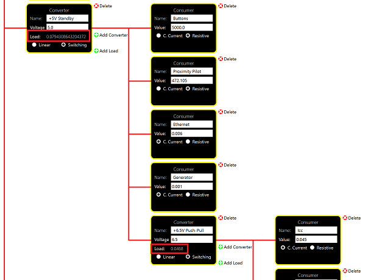

# Description
**Power Tree Solver** (**PTS**) is a graphic utility (based on PyQt) to calculation of power supply networks for PCB design or similar problems.
PTS allow you to build an electric network (in form of a forest, or set of trees, where every root is a global power supply input of your system, every leaf is an end-point consumer), set parameters for its nodes and display consumptions in every node.

The actual version supports the following features:
- Two types of end-point consumers - constant current and fixed resistance
- Two types of DC/DC voltage converters (as inner nodes of tree) - switching (with 100% efficiency) and linear

The PTS app is currently on **alpha-testing stage**.

# Startup
To get PTS, do following:
1. Select the **release** branch of this repo
2. Download the pts.exe file to your local file system
3. Launch the pts.exe file

# Manual
## Alpha Testing
As mentioned above The PTS app is currently on alpha-testing stage. Therefore the app creates and writes a file with debugging log messages during its work. These files are located near the electric net .ens files (see below).

## Networks
In terms of PTS, every electrical device you are designing (e. g. Print Circuit Board) has its own electric net. You can work with one net at the same time.     

You can **create** new net, **load** an existing one from the file in your local file system, and **save** the currently edited net using commands in the app's main menu:      

  
You can select any location in your file system, that you want to save the net in, or that the file you want to load is located in. All these files have extensions '.ens':

While the app is on alpha-testing stage, once the new .ens file is created, the file with debugging log messages is created at the same directory as the .ens file.
These log files need to be sent to the e-mail address izyakantorovich@gmail.com

## Network Structure Editing
To **add** new **power input** to your network, press the corresponding plus widget:

To **add** new **converter** or **end-point consumer** (sink in general terms) to the source (either existing power input or converter) in your net, press the corresponding plus widgets left to the source:

To **delete** any node, just press the cross widget left to the node you want to delete:

If you want to **delete** some **converter**, that has children (no matter converters or consumers), you are asked to choose what to to with these childer - delete with their parent or promote to the higher ancestor:

## Setting Nodes Parameters
To set parameters to nodes of your net, just edit corresponding text fields or switch radio buttons on the graphic nodes on the screen:

## Getting a Solution
Total value of load (in amperes) are being calculated automatically for every source (power inputs and converters) and displayed on the corresponding graphic nodes:

